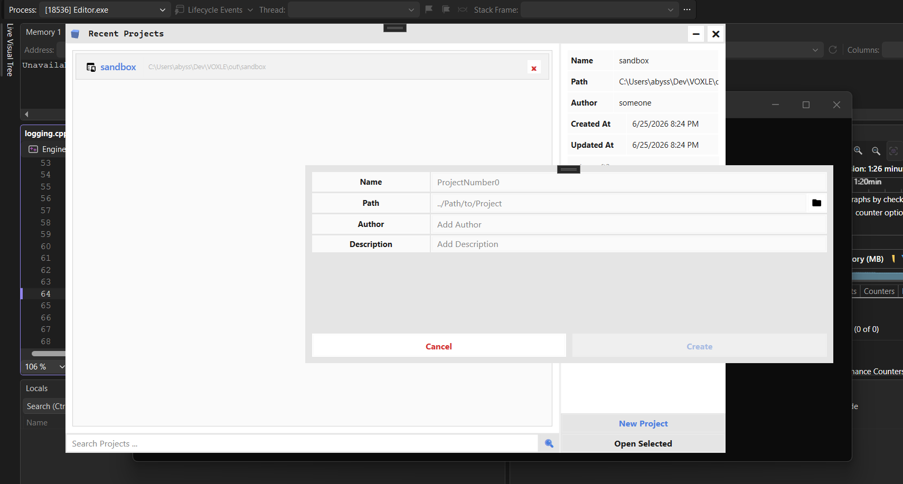
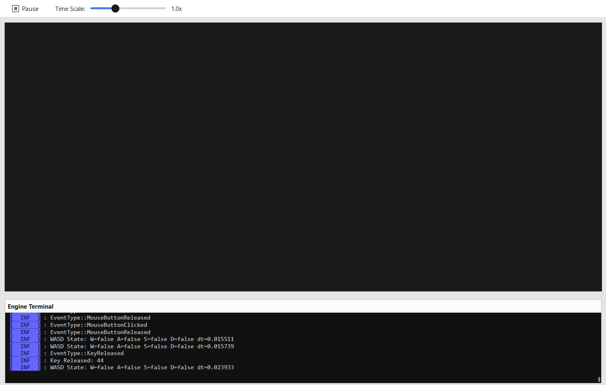

# Voxel-Engine

Voxel-Engine is a custom 3D engine designed to render and simulate voxel-based environments virtual worlds constructed from volumetric pixels ("voxels").

currently under development.

